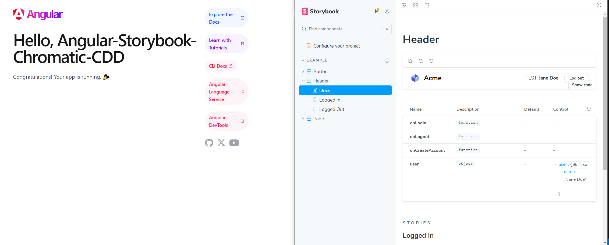
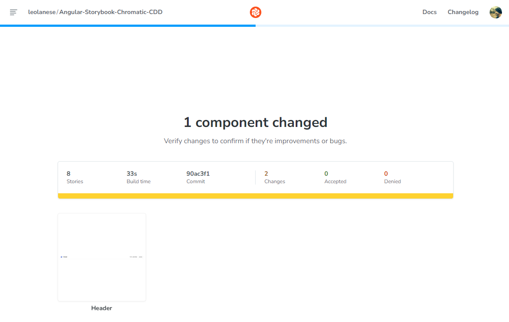
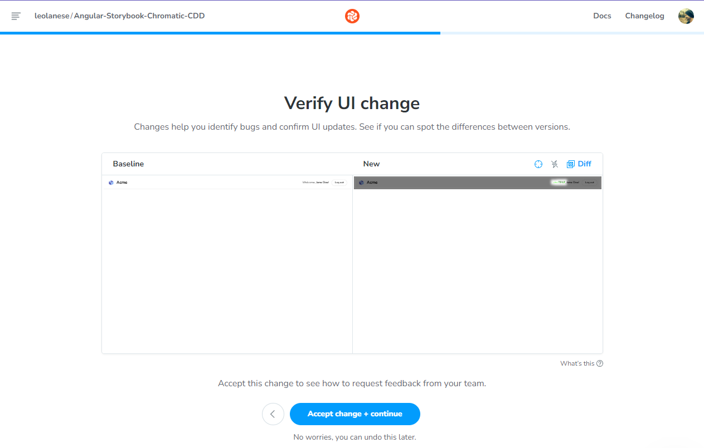
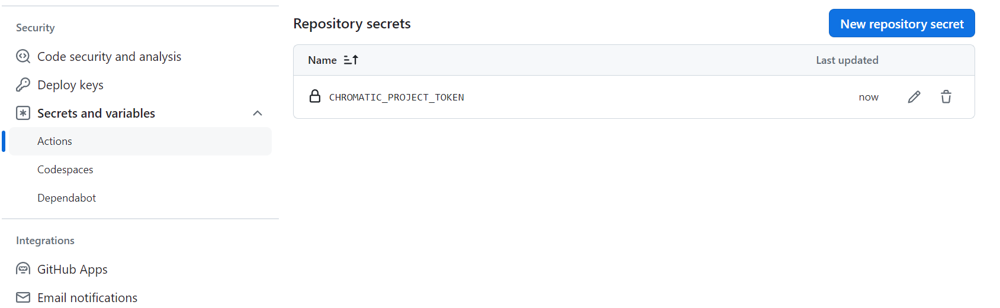
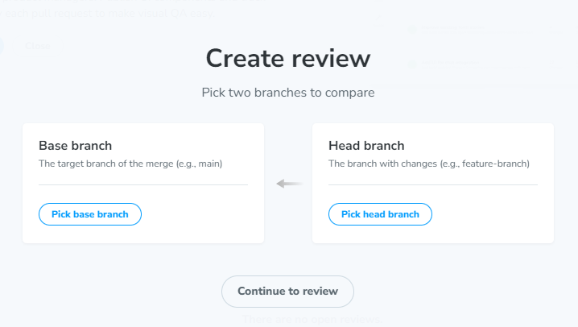

# Angular 17+, Storybook and Chromatic - CDD

> Chromatic is a Visual Regression Test Suit: It can be used to test UI changes in Storybook.
 take snapshots before and after pushing, and make a comparison automaticly

> It lets them visually tests stories automatically and publish their Storybook for others to reference. QA can often feel like the world's longest game of "spot the difference"

## SETUP

```js
// create new angular project
ng new Angular-Storybook-Chromatic-CDD

// Initialize Storybook in your project
npx sb init
```

## Up to this point, we should have

- Angular App running:
localhost:4200

- StoryBook running:
localhost:6006



- Chromatic running:
https://www.chromatic.com/start

- Setup a new project in a Repo (I used gitHub)
Then `Choose your Project` from Chromatic and select the repo:
https://github.com/leolanese/Angular-Storybook-Chromatic-CDD

## Publish Angular-Storybook-Chromatic-CDD's Storybook (Before screenshot)

```js
// Get the Chromatic package
npm install --save-dev chromatic

// Publish your Storybook (using your token provied by Chromatic)
npx chromatic --project-token=chpt_XXXXXXXXXXXXXXXXX

// No 'chromatic' script found in your package.json
// selection 'Y' to add in the package.json
// "chromatic": "npx chromatic --project-token=chpt_XXXXXXXXXXXXXXXXX"
```

## Back to chromatic.com
Now,  you should see a new published Storybook

## Getting into Action! (After screenshot)
Now Click: `Catch a UI change` to Spot UI changes

```js
//  src/stories/Header.components
Let's make a simply change: `Welcome` with `TEST`

git add --all; git commit -m 'Modified Header for testing'; git push

// Run the test publish command again to upload your UI tweaks and have Chromatic catch your changes
yarn chromatic
```



## Verify UI change



- Consultation with the Team + Resolving and mergin!


## Publish Storybook with CI/CD Setup

> We will add Chromatic to out Ci/CD pipeline to automaticly publish Storybook when push

## Add Chromatic to your CI/CD pipeline

```js
//  Add a chromatic script to your package.json and replace it with
"scripts": {
  "chromatic": "chromatic --project-token CHROMATIC_PROJECT_TOKEN --exit-zero-on-changes"
}
```

## GitHub Action for Chromatic. Workflow setup

```js
// .github/workflow/chromatic.yml
name: 'Chromatic'
on: push

jobs:
  test:
    runs-on: ubuntu-latest
    steps:
      - uses: actions/checkout@v1
      - run: yarn
      - uses: chromaui/action@v1
        with:
          token: ${{ secrets.GITHUB_TOKEN }}
          projectToken: ${{ secrets.CHROMATIC_PROJECT_TOKEN }}
```

## Project token secret  in our repo

To securely provide the projectToken to Chromatic, you must configure a GitHub repository secret. First, find your project on Chromatic.com and go to Manage and then Configure.

CHROMATIC_PROJECT_TOKEN + Project Token (provied by Chromatic)

LINK:
https://github.com/leolanese/Angular-Storybook-Chromatic-CDD/settings/secrets/actions



### LINKS
https://www.chromatic.com/docs/github-actions/


> We should see the Action running in GitHub

## Chromatic `Reviews` (Approving) Step in CI/CD

> Click on left side bar `Reviews` on Chromatic, and then Install Chromatic on GitHub` then click Create review` this will add a new step in the Ci/CD pipeline, assign reviewers, etc.

> These needs to work with branching strategy



---

This project was generated with [Angular CLI](https://github.com/angular/angular-cli) version 17.2.3.

## Development server

Run `ng serve` for a dev server. Navigate to `http://localhost:4200/`. The application will automatically reload if you change any of the source files.

## Code scaffolding

Run `ng generate component component-name` to generate a new component. You can also use `ng generate directive|pipe|service|class|guard|interface|enum|module`.

## Build

Run `ng build` to build the project. The build artifacts will be stored in the `dist/` directory.

## Running unit tests

Run `ng test` to execute the unit tests via [Karma](https://karma-runner.github.io).

## Running end-to-end tests

Run `ng e2e` to execute the end-to-end tests via a platform of your choice. To use this command, you need to first add a package that implements end-to-end testing capabilities.

## Further help

To get more help on the Angular CLI use `ng help` or go check out the [Angular CLI Overview and Command Reference](https://angular.io/cli) page.
